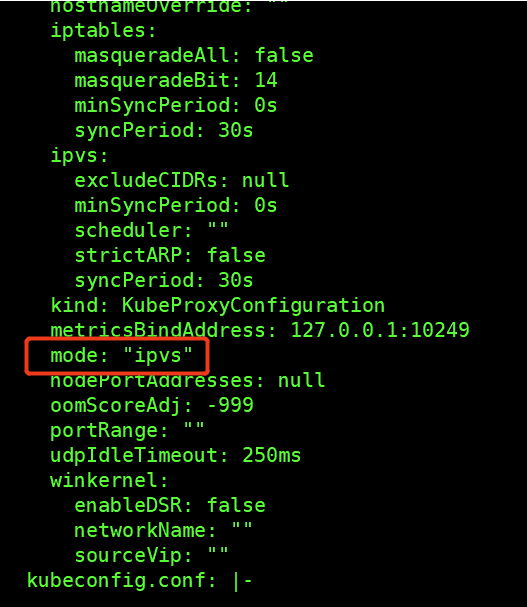

#### 1.环境初始化
##### 1.1 检查操作系统的版本
- 本次安装kubernetes集群使用的版本是Rocky Linux release 8.5

```shell
[root@kube-master ~]# cat /etc/redhat-release
Rocky Linux release 8.5 (Green Obsidian)
```

##### 1.2 主机名解析
- 为了方便集群节点间的直接调用，在这个配置一下主机名解析，企业中推荐使用内部DNS服务器
 - 这里可以编辑/etc/hosts文件，添加以下内容

```shell
192.168.107.162 kube-master.skills.com
192.168.107.163 kube-node1.skills.com
192.168.107.164 kube-node2.skills.com
```

##### 1.3 时间同步

- kubernetes要求集群中的节点时间必须精确一直，这里使用chronyd服务从网络同步时间,企业中建议配置内部的会见同步服务器

```shell
[root@kube-master ~]# systemctl start chronyd
[root@kube-master ~]# systemctl enable chronyd
```

##### 1.4  禁用iptable和firewalld服务

- kubernetes和docker 在运行的中会产生大量的iptables规则，为了不让系统规则跟它们混淆，直接关闭系统的规则
 - 关闭防火墙

```shell
[root@kube-master ~]# systemctl stop firewalld
[root@kube-master ~]# systemctl disable firewalld
```
 - 关闭ntfables或者iptables

   - ntftables:

```shell
[root@kube-master ~]# systemctl stop nftables
[root@kube-master ~]# systemctl disable nftables
```
   - iptables:

```shell
[root@kube-master ~]# systemctl stop iptables
[root@kube-master ~]# systemctl disable iptables
```

##### 1.5 禁用selinux
- selinux是linux系统下的一个安全服务，如果不关闭它，在安装集群中会产生各种各样的奇葩问题
  - 编辑/etc/selinux/config 文件，修改SELINUX的值为disable
  - 注意修改完毕之后需要重启linux服务
 
 ```shell
 SELINUX=disabled
 ```

##### 1.6 禁用swap分区
-  swap分区指的是虚拟内存分区，它的作用是物理内存使用完，之后将磁盘空间虚拟成内存来使用，启用swap设备会对系统的性能产生非常负面的影响，因此kubernetes要求每个节点都要禁用swap设备，但是如果因为某些原因确实不能关闭swap分区，就需要在集群安装过程中通过明确的参数进行配置说明
  - 编辑分区配置文件/etc/fstab，注释掉swap分区一行,注意修改完毕之后需要重启linux服务

    - 编辑/etc/fstab

```shell
注释掉 /dev/mapper/centos-swap swap
# /dev/mapper/centos-swap swap
```
    - 临时关闭swap分区

```shell
[root@kube-master ~]# swapoff -a
```
    - 查看swap分区是否关闭,使用命令free

```shell
[root@kube-master]# free
              total        used        free      shared  buff/cache   available
              Mem:        3825584      179508     3422976        8760      223100     3417568
```

##### 1.7 修改linux的内核参数

- 创建containerd.conf文件并添加一下内容:

```shell
cat > /etc/modules-load.d/containerd.conf <<EOF
overlay
br_netfilter
EOF
```
  - 加载网桥过滤模块:

```shell
[root@kube-master ~]# modprobe overlay
[root@kube-master ~]# modprobe br_netfilter
```
   - 查看网桥过滤模块是否加载成功

```shell
[root@kube-master ~]# lsmod | grep br_netfilter
``` 
  - 修改linux的内核采纳数，添加网桥过滤和地址转发功能,编辑/etc/sysctl.conf文件，添加如下配置：

```shell
net.bridge.bridge-nf-call-iptables  = 1
net.ipv4.ip_forward                 = 1
net.bridge.bridge-nf-call-ip6tables = 1
```
  - 添加完成后重新加载配置
    - 加载方法1:

```shell
[root@kube-master ~]# sysctl --system
```

    - 加载方法2:

```shell
[root@kube-master ~]# sysctl -p
```

##### 1.8 安装containerd

- 安装采用离线安装的方式需要事先将containerd的包下载下来,当然你也可以选择在线安装
 - 安装包版本为:

```shell 
containerd.io-1.5.10-3.1.el8.x86_64.rpm
```
 - 生成containerd配置文件:

```shell
[root@kube-master ~]# containerd config default > /etc/containerd/config.toml
```

 - 编辑/etc/containerd/config.toml配置文件
   - 注释掉这一行systemd_cgroup = false 在前面添加#systemd_cgroup = false
   - 修改sandbox_image = "k8s.gcr.io/pause:3.7"，将pause版本改为当前使用的版本
   - 启动和设置开机自启containerd

```shell
[root@kube-master ~]# systemctl restart containerd
[root@kube-master ~]# systemctl enable containerd
```

##### 1.9 安装Kubernetes组件
- 使用如下命令查看需要的容器:
`[root@kube-master ~]# kubeadm config images list`

- 安装采用离线安装的方式，需要事先下载好kubernetes的所有包，当然你也可以选择在线安装
  - 安装的包如下:

```shell
cni-0.8.7-0.x86_64.rpm
conntrack-tools-1.4.4-10.el8.x86_64.rpm
cri-tools-1.23.0-0.x86_64.rpm
kubeadm-1.23.5-0.x86_64.rpm
kubectl-1.23.5-0.x86_64.rpm
kubelet-1.23.5-0.x86_64.rpm
libnetfilter_cthelper-1.0.0-15.el8.x86_64.rpm
libnetfilter_cttimeout-1.0.0-11.el8.x86_64.rpm
libnetfilter_queue-1.0.4-3.el8.x86_64.rpm
socat-1.7.4.1-1.el8.x86_64.rpm
```
  - 架设好yum仓库后使用如下命令安装:

```shell
[root@kube-master ~]# dnf install kube*
```
  - 配置kubelet的cgroup
   - 编辑/etc/sysconfig/kubelet, 删除原有内容,添加下面的配置

```shell
KUBELET_CGROUP_ARGS="--cgroup-driver=systemd"
```
   - 设置kubelet开机自启

```shell
[root@kube-master ~]# systemctl enable kubelet
```
   - 安装iproute-tc,如果不安装会在初始化的时候显示如下警告

```shell
[prefLight] WARNING: tc not found in system path
```

##### 1.10 准备集群镜像
- 在安装kubernetes集群之前，必须要提前准备好集群需要的镜像，所需镜像可以通过下面命令查看
- 我们这里采用离线方式安装，事先会讲集群的容器全部下载好，并且导入到所有节点
  - 使用如下命令将集群容器导入containerd

```shell
ctr -n k8s.io i import coredns.tar
ctr -n k8s.io i import etcd.tar
ctr -n k8s.io i import kube-apiserver.tar
ctr -n k8s.io i import kube-proxy.tar
ctr -n k8s.io i import kube-scheduler.tar
ctr -n k8s.io i import kube-controller-manager.tar
ctr -n k8s.io i import pause35.tar
ctr -n k8s.io i import pause36.tar
ctr -n k8s.io i import flannel.tar    #pod内部的网络插件
ctr -n k8s.io i import flannelcni.tar #pod内部的网络插件
重新启动所有节点，用来让所有配置生效(关闭swap,关闭selinux等)
```
# **前面这些操作在所有节点上要做！**


## **以下操作只需要在master点上执行**
##### 1.11 集群初始化
- 创建集群

```shell
[root@master ~]# kubeadm init \
	--apiserver-advertise-address=192.168.107.161 \  #master节点地址
	--kubernetes-version=v1.23.5 \                   #kubernetes版本
	--service-cidr=10.96.0.0/12 \                    #集群网段
	--pod-network-cidr=10.244.0.0/16                 #pod内部通信网段
	--cri-socket=/run/containerd/containerd.sock     #使用containerd作为集群镜像启动器
	--ignore-preflight-errors=all                    #跳过所有错误
```
- 创建必要文件

```shell
[root@kube-master ~]# mkdir -p $HOME/.kube
[root@kube-master ~]# sudo cp -i /etc/kubernetes/admin.conf $HOME/.kube/config
[root@kube-master ~]# sudo chown $(id -u):$(id -g) $HOME/.kube/config
```

## **以下操作只需要在node点上执行**

- 以下命令将node节点加入群集

```shell
kubeadm join 192.168.107.162:6443 --token god06n.fow0yn46h004djgs \
	--discovery-token-ca-cert-hash sha256:2af99de0c8d541eb50de83045c9e0a03975d8c6633f7f00a0c9461803a155a8d
```
  - 重新生成node节点加入的token
  
  ```shell
  [root@kube-master ~]# kubeadm token create --print-join-command
  ```
- 在master上查看节点信息

```shell
[root@kube-master ~]# kubectl get nodes
NAME                     STATUS     ROLES                  AGE    VERSION
kube-master.skills.com   NotReady   control-plane,master   4m3s   v1.23.5
kube-node1.skills.com    NotReady   <none>                 61s    v1.23.5
kube-node2.skills.com    NotReady   <none>                 40s    v1.23.5
```
**这里我们看到所有的几点都是NotReady状态，这是因为没有安装网络插件**


##### 1.12 安装网络插件，只在master节点操作即可
- 这里我们用的网络插件是比较常见的flannel，当然还有别的网络插件也可以使用
- 我们前面已经将flannel的容器导入到containerd中了，那么现在我们只需要使用flannel的yaml文件部署一下插件即可：

```shell
[root@kube-master kubecon]# kubectl apply -f kube-flannel.yml 
```
 - 其中kube-flannel.yml文件可以去官网直接下载
 - 也可以使用calio作为网络插件，执行以下指令部署calico网络插件
 ```shell
 [root@kube-master kubecon]# kubectl apply -f calico.yaml
 ```
 - 加载完成后我们再查看集群各节点状态:

```shell
[root@kube-master kubecon]# kubectl get nodes
NAME                     STATUS   ROLES                  AGE     VERSION
kube-master.skills.com   Ready    control-plane,master   8m55s   v1.23.5
kube-node1.skills.com    Ready    <none>                 5m53s   v1.23.5
kube-node2.skills.com    Ready    <none>                 5m32s   v1.23.5
```
**可以看到已经显示为Ready了，到这里我们的kubernetes集群就搭建好了**


##### 1.13 ipvs部署
- 在Kubernetes中Service有两种带来模型，一种是基于iptables的，一种是基于ipvs的两者比较的话，ipvs的性能明显要高一些，但是如果要使用它，需要手动载入ipvs模块
- 下面操作在所有节点上都要做:
```shell
# 1.安装ipset和ipvsadm
[root@master ~]# yum install ipset ipvsadm -y
# 2.添加需要加载的模块写入脚本文件
[root@master ~]# cat <<EOF> /etc/sysconfig/modules/ipvs.modules
#!/bin/bash
modprobe -- ip_vs
modprobe -- ip_vs_rr
modprobe -- ip_vs_wrr
modprobe -- ip_vs_sh
modprobe -- nf_conntrack
EOF
# 3.为脚本添加执行权限
[root@master ~]# chmod +x /etc/sysconfig/modules/ipvs.modules
# 4.执行脚本文件
[root@master ~]# /bin/bash /etc/sysconfig/modules/ipvs.modules
# 5.查看对应的模块是否加载成功
[root@master ~]# lsmod | grep -e ip_vs -e nf_conntrack
```
- 下面操作只要在主节点上做:
```shell
# 1.编辑kube-proxy配置文件： 
[root@master ~]# kubectl edit configmap -n kube-system kube-proxy
# 2.将配置文件中mode=""参数改为mode="ipvs",配置完成后保存重启。修改如下图：
```

```shell
# 3.查看当前的kube-proxy组件
[root@master ~]# kubectl get pod -n kube-system | grep proxy
kube-proxy-b4n8g                 1/1     Running   0          17m
kube-proxy-b652f                 1/1     Running   0          16m
kube-proxy-cthmc                 1/1     Running   0          16m
# 4.重启kube-proxy，因为kube-proxy有期望副本数，所以这里直接删除后集群会自动拉起新的pod，达到重启的效果
[root@master ~]# kubectl delete  pod -n kube-system kube-proxy-b4n8g
[root@master ~]# kubectl delete  pod -n kube-system kube-proxy-b652f
[root@master ~]# kubectl delete  pod -n kube-system kube-proxy-cthmc
# 5.然后使用ipvsadm命令查看是否成功
[root@master ~]# ipvsadm -ln    #有输出表示成功切换为ipvs
```


##### 1.14 集群测试
- 创建一个nginx服务

```shell
kubectl create deployment nginx  --image=nginx:1.14-alpine
```

- 暴露端口

```shell
kubectl expose deploy nginx  --port=80 --target-port=80  --type=NodePort
```

- 查看服务

```shell
kubectl get pod,svc
```

- 查看pod


- 浏览器测试结果：


